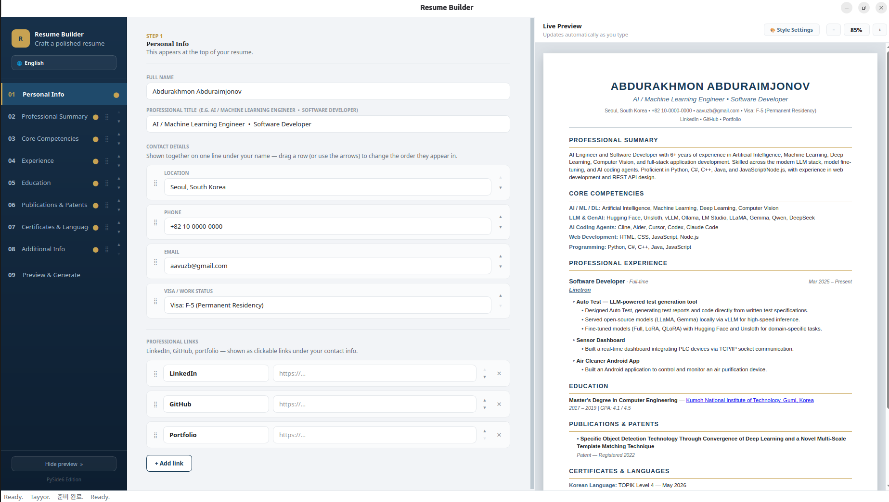
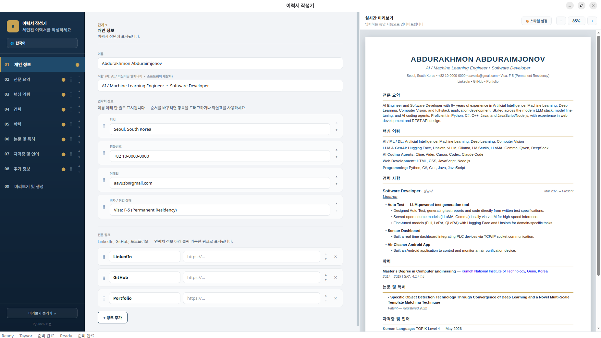
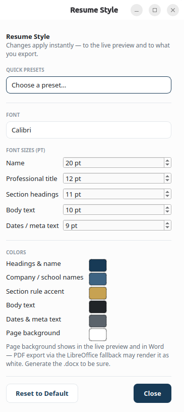
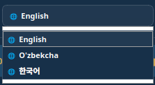
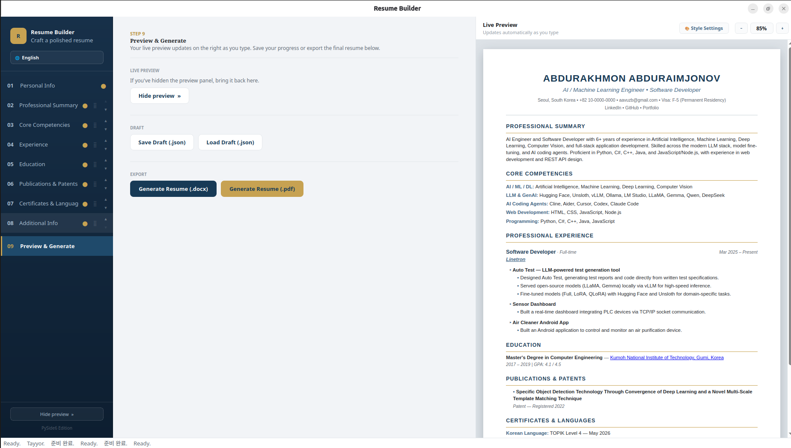
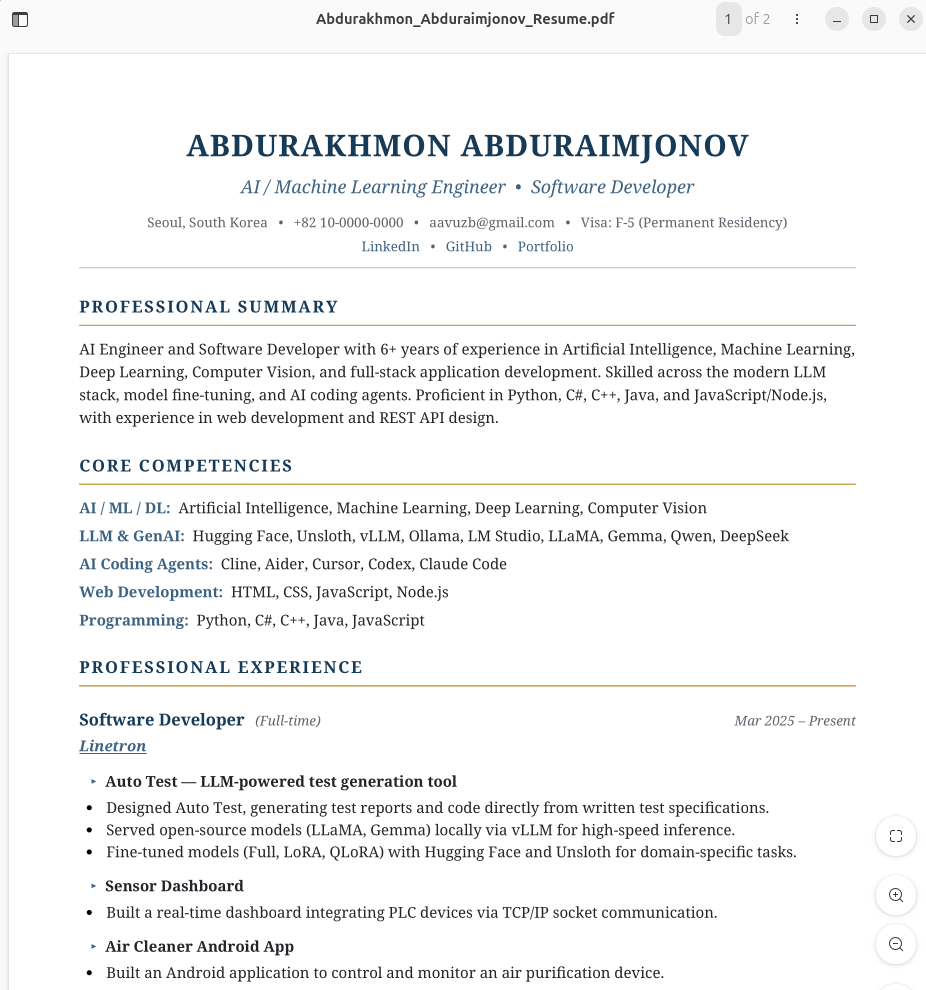

# Resume Builder

A free, open-source desktop app for building a polished, professional resume — with a live preview, drag-and-drop section reordering, custom styling, multi-language support, and one-click export to **.docx** and **.pdf**.

Built with [PySide6](https://doc.qt.io/qtforpython/) (Qt for Python).



## Features

- **Live preview** — the right-hand panel renders your resume as real HTML while you type, so what you see is what gets exported.
- **Field highlighting** — click into any field on the left and the matching spot in the preview lights up (and auto-scrolls into view if it's further down the page), so you always know exactly what you're editing.
- **Drag-and-drop reordering** — reorder sidebar sections, contact fields, label/value rows, and individual work-experience projects by dragging them into place.
- **Resume Style panel** — change the font, five independent font sizes (name, title, headings, body, meta), six accent/text/background colors, and the page background, all applied instantly. Includes five ready-made style presets: *Navy & Brass*, *Charcoal & Slate*, *Forest & Sand*, *Burgundy Classic*, and *Modern Teal*.
- **Multi-language interface** — the app UI and the exported resume's section headings/labels are available in **English**, **O'zbekcha** (Uzbek), and **한국어** (Korean).
- **Structured work history** — separate Start Date / End Date fields and an Employment Type dropdown (Full-time, Part-time, Contract, Internship, Freelance, etc.) that's stored independently of the interface language.
- **Professional Links** — dedicated fields for LinkedIn, GitHub, and Portfolio links.
- **Draft save/load** — save your in-progress resume as a `.json` draft and reload it later to keep editing.
- **Export** — generate a ready-to-send **.docx** file, or a **.pdf** (via Microsoft Word/`docx2pdf` on Windows/macOS, or a LibreOffice headless fallback on any platform).

## Screenshots

| | |
|---|---|
| **Personal Info, with live preview** | **The same form, in Korean** |
|  |  |
| **Resume Style panel** | **Language switcher** |
|  |  |
| **Preview & Generate step** | **Exported PDF** |
|  |  |

## Getting started

### Requirements

- Python 3.9+
- [PySide6](https://pypi.org/project/PySide6/)
- [python-docx](https://pypi.org/project/python-docx/)

PDF export additionally needs one of:
- **Windows/macOS** — install Microsoft Word, or install [`docx2pdf`](https://pypi.org/project/docx2pdf/) (on Windows this also uses `comtypes` to drive Word).
- **Any platform** (including Linux) — install [LibreOffice](https://www.libreoffice.org/download) as a free fallback; the app calls it in headless mode to convert the resume.

If neither is available, "Generate Resume (.pdf)" shows a clear error explaining what to install — `.docx` export always works regardless.

### Install

```bash
pip install -r requirements.txt
```

### Run

```bash
python main.py
```

## How it works

- The left sidebar moves between sections: Personal Info, Summary, Core Competencies, Experience, Education, Publications & Patents, Certificates & Languages, Additional Info, and Preview & Generate.
- The right-hand panel is a **live preview** — an actual rendered resume page (same layout, colors, and type-scale as the generated `.docx`/`.pdf`) that updates automatically as you edit the form. Use the `−` / `100%` / `+` buttons to zoom, or "Hide preview" in the sidebar to reclaim horizontal space on smaller screens.
- **Field highlighting** — clicking into a field highlights the matching spot in the preview and auto-scrolls it into view if needed, so you always know exactly what you're editing.
- Each sidebar item shows a small dot that lights up once that section has content, so you can see progress at a glance.
- **Section order is yours to set** — Professional Summary through Additional Info can be dragged (or moved with the ▲/▼ buttons) into whatever order you draft in; the live preview and the exported `.docx`/`.pdf` always follow it, not just the sidebar. Contact fields, label/value rows, and individual experience projects can be reordered the same way.
- **Resume Style** (the "🎨 Style" button above the preview) lets you set the font, five font sizes, six colors, and the page background for the resume itself — separate from this app's own interface. Five ready-made presets are included, or pick every color by hand. Changes apply instantly to the live preview and to what you export.
- **Experience** works company-first: click **"+ Add company / position"** to create a card for each job (title, company, employment type, start/end dates), then inside that card click **"+ Add project"** for each deliverable/project you worked on there. Each project has its own name and its own bullet points (one per line), and projects can be dragged to reorder.
- **Education** and **Publications & Patents** use "+ Add" cards the same way, one per entry.
- **Core Competencies**, **Certificates**, and **Additional Info** use simple label → details rows (e.g. `LLM & GenAI` → `Hugging Face, Ollama, vLLM...`).
- **Professional Links** lets you add LinkedIn, GitHub, and Portfolio URLs alongside your contact details.
- Use the language switcher to work in **English**, **O'zbekcha**, or **한국어** — this changes both the app's own interface and the section headings/labels in your exported resume.
- The tool opens pre-filled with example content so you can see the format immediately — just overwrite the fields with your own information.
- **Save Draft (.json)** / **Load Draft (.json)** let you save your progress and come back to it later.
- **Generate Resume (.docx)** exports a formatted Word document.
- **Generate Resume (.pdf)** exports the same resume directly as a PDF (built via a temporary `.docx`, then converted using Word/LibreOffice). This runs on a background thread so the UI stays responsive while converting.

## Project structure

| File | Purpose |
|---|---|
| `main.py` | Application entry point |
| `main_window.py` | The main window: sidebar navigation, form pages, data collection, draft save/load, and export actions |
| `widgets.py` | Reusable UI atoms (cards, nav buttons) and the dynamic drag-and-drop list widgets (experience, education, publications, skills) |
| `preview.py` | Renders the resume data as HTML and drives the live `QWebEngineView` preview panel, including field highlighting and auto-scroll |
| `theme.py` | The app's own color palette, font-fallback detection, and application-wide stylesheet (this is the *app's* chrome — see `resume_style.py` for the resume's own look) |
| `resume_style.py` | The resume's font/sizes/colors/background: defaults, bounds, sanitization, and curated presets, shared by `preview.py` and `docx_engine.py` so the two never drift apart |
| `style_dialog.py` | The non-modal "Resume Style" settings window |
| `i18n.py` | Translations for the app UI and the exported resume's headings/labels (English, Uzbek, Korean) |
| `sample_data.py` | The example content the app opens with |
| `docx_engine.py` | Builds the styled `.docx` file and handles PDF conversion (no GUI dependencies, so it's reusable on its own); also owns the section-order and style resolution logic shared with the live preview |
| `requirements.txt` | Python dependencies (`PySide6`, `python-docx`, plus optional PDF-export packages) |

## License

This project is free and open-source, licensed under the [MIT License](LICENSE).
